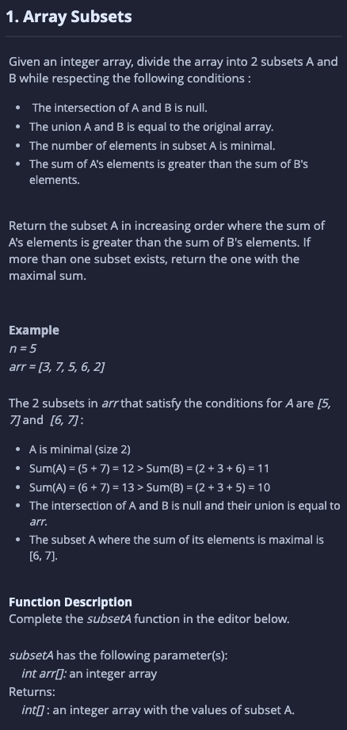
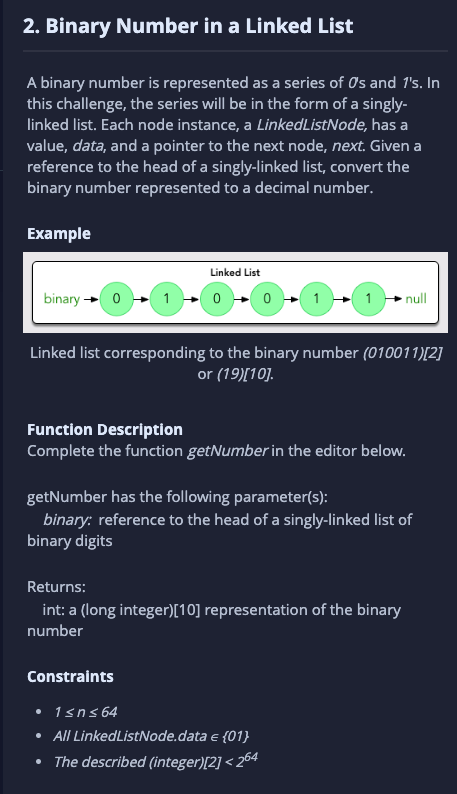
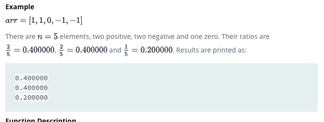

# Code Challenges

- This is a repo of my various code challanges.

## IBM Sample Questions

1. Question one invloved splitting an array into 2 subarrays under certain conditions:

   - The intersection of A and B is Null - the elements found in A must not be found in B
   - The Union of A and B is == the original array.
   - The number of elements in A is minimal
   - 

     
View the original Question

       
     

   - I was unable to bring down the runtime to less than 10 sec for larger arrays

2. Question involved linked list traversal, I was supposed to get the data in the nodes, collate them and translate them from binary to decimal.   

   - 
View the original Question

       
     
   I was able to solve this question and pass all the tests.

# Daily Tests

## Day 1

### PlusMinus - Hackerrank

Given an array of integers, calculate the ratios of its elements that are positive, negative, and zero.
Print the decimal value of each fraction on a new line with places after the decimal.

     
Example

       
     

